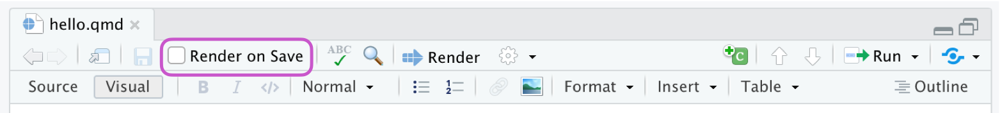

```{r, include = F}
# This is the recommended set up for flipbooks
# you might think about setting cache to TRUE as you gain practice --- building flipbooks from scratch can be time consuming
knitr::opts_chunk$set(fig.width = 5, message = FALSE, warning = FALSE, comment = "", cache = F)
library(flipbookr)
library(tidyverse)
```


class: center, inverse2

### DSC3091 - Advanced Statistical application I

# Introduction to Report writing with R
.center[]


---
class:  middle

## EXPECTATION OF THE CLASS

- Not to become an expert in all statistical software packages but to become an expert data scientist

- Present an overview of what solutions are available with the emphasis on free open source software

- Develop the skill set necessary to perform key aspects of data science efficiently. 

- The course covers the application of basic and advanced concepts in the R programming environment to allow a scalable implementation.

<br/>
<br/>

## Course Evaluation

- Continuous Assesments (Mid Exam/Assignments): 40%
- End Semester Examination: 60%

---
class:  middle
# Code movies or Flipbooks

- Flipbooks shows how to get from ‘A’ to ‘B’ in data manipulation, analysis, or visualization code pipelines.

- Using flipbookr package you can present your code step-by-step and side-by-side with its output.

- Together with the R package 'xaringan', flipbookr does four things:

  1. Parses an .Rmd code pipeline from the chunk you indicate
  2. Identifies break points in that code chunk pipeline 
  3. Spawns a bunch of code chunks with these partial builds of code, separated by slide breaks, and
  4. Displays partial code in HTML slides.

<br/>
<br/>
# Example  

---
`r chunk_reveal("slide1")`
```{r slide1, include = FALSE, count=FALSE}
set.seed(12345)
library(tidyverse)
mtcars %>%
  rownames_to_column(var = "model") %>%
  ggplot() + #BREAK
  aes(x = wt * 1000) +#BREAK
  aes(y = factor(cyl)) +#BREAK
  ggthemes::theme_solarized() +#BREAK
  geom_boxplot(fill = "snow2") +#BREAK
  geom_jitter(height = .2, alpha = .8,
              color = "plum3", size = 3) +#BREAK
  labs(y = "Number of Cylinders") +
  labs(x = "Weight in pounds") +
  labs(title = "How do number of cylinders and model weight relate?") +
  labs(subtitle = "Motor Trend US magazine's comparison of thirty-two 1973-74 models") +
  theme(plot.title.position = "plot")
```

---
# Create your own flipbook

- After installing flipbookr with `install.packages("flipbookr")`  or `devtools::install_github("EvaMaeRey/flipbookr"),` we can use the following menu commands to open a minimal flipbook.

  File -> New File -> R Markdown -> From Template -> A Minimal Flipbook

- Further, you need `rmarkdown` and `Xaringan` packages, which you can download directly from CRAN.

- The YAML meta data of this file given below presents an html {xaringan} slide show output.

```
title: "A minimal flipbook"
subtitle: "With flipbookr and xaringan"
author: "You!"
output:
  xaringan::moon_reader:
    lib_dir: libs
    css: [default, hygge, ninjutsu]
    nature:
      ratio: 16:9
      highlightStyle: github
      highlightLines: true
      countIncrementalSlides: false
```

---
class:  middle
# YAML meta data 

- `knit` the .Rmd file by giving a name.

- Then, in the current folder, two new folders `libs` and `test_files` will be created.

- The header attributes and CSS files are saved in the `libs` folder, and note that `libs` is the folder name that we have specified in the lib_dir in YAML.

- The figures relevant to this `test.Rmd` are saved in the test_files folder.

- The three CSS files mentioned in YAML are,

    1. `default` - default CSS for formatting xaringan \
    2. `hygge` - CSS for further formatting xaringan \
    3. `ninjutsu` - CSS for the theme for slides.

- The ratio in YAML gives the width and height of the slides.

- The option `highlightLines:true` of nature will highlight code lines, and `highlightStyle:github` use the specific style.

- Setting the option `countIncrementalSlides:false` will not be displayed a number when each slide is incremented with each new slide.


---
class: middle
# The setup chunk in .Rmd file

```
# This is the recommended set up for flipbooks
# you might think about setting cache to TRUE as you gain practice --- building
flipbooks from scratch can be time consuming
knitr::opts_chunk$set(fig.width = 6, message = FALSE, warning = FALSE, 
comment = "", cache = F)
library(flipbookr)
library(tidyverse)
```
<br/>

- Here, we specify the relevant options to ignore showing messages, warnings or comments in slides when running R codes.

- We can also set up the width of the figures. 

- We can specify to load {flipbookr}, and other packages that you need for your presentation in this setup chunk.

---
# Create a 'source' code chunk with a code pipeline

-  A source code chunk, named 'my_cars'

.left[]

- In your .Rmd use the {flipbookr} function `chunk_reveal()` inline as follows. Refer to the source code chunk that you have prepared by name.

.left[]

---
`r chunk_reveal(chunk_name = "my_cars", title = "### First flipbook")`

```{r my_cars, include = FALSE}
cars %>%
  filter(speed > 4) %>%
  ggplot() +
  aes(x = speed) + #BREAK
  aes(y = dist) + #BREAK
  geom_point(
    alpha = .8, 
    color = "blue" 
    ) + 
  aes(size = speed) #BREAK
```

- Also, indicate you want a slide break before the inline code as shown above. The slide break is indicated with three dashes, '---' at the beginning of a line with no trailing spaces.

---
class: center middle inverse2

# Let's Try Out!

---
# How to define the break points?

- There are several ways that input code can be revealed:

  * auto
  * user
  * non_seq
  * rotate
  * 5 (set to an integer)

```
cars %>%
  filter(speed > 4) %>%
  ggplot() +
  aes(x = speed) + #BREAK
  aes(y = dist) + #BREAK
  geom_point(
    alpha = .8, 
    color = "blue" 
    ) + 
  aes(size = speed) #BREAK
```

- In the above code, notice the `#BREAK` comments, these will be used for a couple of the different break_type modes.

---
class: middle
- `break_type = "auto"`

  The default break_type is "auto", in which appropriate breakpoints are determined automatically --- by finding where parentheses are balanced.
  
- `break_type = "user"`, with #BREAK

  If the break_type is set to "user", the breakpoints are those indicated by the user with the special comment #BREAK
  
- `break_type = "non_seq"`, with #BREAK2, #BREAK3

  If the break_type is set to "non_seq", the breakpoints are those indicated by the user with the special numeric comment #BREAK2, #BREAK3 etc to indicate at which point in time the code should appear.
  
- `break_type = "rotate"`

  And break_type = "rotate" is used to to cycle through distinct lines of code. The special comment to indicate which lines should be cycled through is #ROTATE.

More details: https://evamaerey.github.io/flipbooks/flipbook_recipes#48

---
`r chunk_reveal(chunk_name = "my_cars2", title = "### Second flipbook", break_type="user")`

```{r my_cars2, include = FALSE}
cars %>%
  filter(speed > 4) %>%
  ggplot() +
  aes(x = speed) + #BREAK
  aes(y = dist) + #BREAK
  geom_point(
    alpha = .8, 
    color = "blue" 
    ) + 
  aes(size = speed) #BREAK
```

---
class: center middle inverse2

# Quarto Documents

---
# Quarto Documents

- Quarto is a multi-language, next-generation version of R Markdown from RStudio.

- Includes dozens of new features and capabilities while at the same being able to render most existing Rmd files without modification.

- Quarto documents are saved with the .qmd extension, and can be rendered as HTML file.

- You could also choose to render it into other formats like PDF, MS Word, etc.

.center[]

---
# Let's Get Started!

- Download and install the latest release of RStudio (v2022.02+)

- Download the quarto library from the link below

  https://quarto.org/docs/get-started/

- Once you install it, choose your tool and get started
.center[]

- Be sure that you have installed the `tidyverse` and `palmerpenguins` packages

  ```
  install.packages("tidyverse")
  install.packages("palmerpenguins")
  ```

- Open the `hello.qmd` in your working directory in RStudio, and click on Render

---
# Rendering

- Use the `Render` button in the RStudio IDE to render the file and preview the output with a single click or keyboard shortcut (Ctrl+Shift+K).

```{r, out.width = "800px", echo = FALSE}
knitr::include_graphics("images/render1.png")
```

- If you prefer to automatically render whenever you save, you can check the Render on Save option on the editor toolbar.

```{r, out.width = "800px", echo= FALSE}

```

- The preview will update whenever you re-render the document. Side-by-side preview works for both HTML and PDF outputs.

```{r, out.width = "800px", echo= FALSE}
knitr::include_graphics("images/render3.png")
```

---
class: middle
# Authoring

- RStudio editor contains two modes of the same quarto document: visual and source 

- Visual editor offers an `WYSIWYM` authoring experience for markdown.

-  The source code of the same document is written for you and you can view/edit it at any point by switching to source mode for editing.

- You can toggle back and forth these two modes by clicking on Source and Visual in the editor toolbar.

---
# Contents of a Quarto document

- A Quarto document contains three types of content: 

  1. a YAML header,
  2. code chunks, and 
  3. markdown text.

## YAML header

 ```
 ---
 title: "Hello, Quarto"
 format: html
 editor: visual
 ---
 ```

- When rendered, the title , "Hello, Quarto", will appear at the top of the rendered document with a larger font size

- The other two YAML fields in denote that the output should be in html format and the document should open in the visual editor

- The basic syntax of YAML uses key-value pairs in the format `key: value`. 

- Other YAML fields commonly found in headers of documents include metadata like `author, subtitle, date` as well as customization options like `theme, fontcolor, fig-width`, etc. 
 
---
## Code chunks

- R code chunks identified with `{r}` with (optional) chunk options. 

- Chunk options can be defined by `#|` at the beginning of the line.

 ```{r, echo= FALSE}
 knitr::include_graphics("images/Chunk2.png")
 ```

## Markdown text

- Quarto uses markdown syntax for text. 

- If using the visual editor, you can use the menus and shortcuts to add a header, bold text, insert a table, etc. 


---
# Computations 

- For some documents, you may want to hide all of the code and just show the output. To do so, specify `echo: false` within the `execute` option in the YAML.

    ---
     title: "Quarto Computations"
     execute:
       echo: false
    ---
  
- To selectively enable code echo for some cells, add the `echo: true` cell option.

  ```
    #| label: scatterplot
    #| echo: true

    ggplot(mpg, aes(x = hwy, y = cty, color = cyl)) +
      geom_point(alpha = 0.5, size = 2) +
      scale_color_viridis_c() +
      theme_minimal()
  ```
---
# Code Folding

- Rather than hiding code entirely, you might want to fold it and allow readers to view it at their discretion. 

- You can do this via the code-fold option. 

- Remove the `echo` option we previously added and add the `code-fold` HTML format option.

    ---
      title: "Quarto Computations"
      format:
        html:
         code-fold: true
    ---

- You can also provide global control over code folding. Try adding `code-tools: true` to the HTML

---
# Code Linking

- The code-link option enables hyper-linking of functions within code blocks to their online documentation. 

- Try adding `code-link: true` to the HTML format options.

    ---
    title: "Quarto Computations"
    format:
      html:
        code-link: true
    ---

- Note that code linking is currently implemented only for the knitr engine via the `downlit` package.
---
# Caching

- If your document includes code chunks that take too long to compute, you might want to cache the results of those chunks.

- Use the cache option at the document level 

    ---
    execute:
      cache: true
    ---  

- Use the cache option for a particular chunk

    ---
    #| cache: true
    ---

---
# Inline Code

- To include executable expressions within markdown, enclose the expression in ``` `r ` ```

- Eg: There are 'r nrow(mpg)`  observations in our data.

    ---
      There are `r nrow(mpg)` observations in our data.
    ---

- If the expression you want to inline is more complex, it is recommend including it in a code chunk (with `echo: false`)


```{r slide2, include = FALSE}
mean_cty <- round(mean(mpg$cty), 2)
mean_hwy <- round(mean(mpg$hwy), 2)
```

    
    #| echo: false

    mean_cty <- round(mean(mpg$cty), 2)
    mean_hwy <- round(mean(mpg$hwy), 2)

- Then, add the following markdown text to your Quarto document.

    
    The average city mileage of the cars in our data is `r mean_cty` and the average highway 
    mileage is `r mean_hwy`. 

---
# Data Frames

- You can control how data frames are printed by default using the df-print document option. Available options include:

```{r, out.width = "800px", echo= FALSE}
knitr::include_graphics("images/Data_frames.png")
```

    ---
    title: "Document"
    format: 
       html:
         df-print: paged
    ---

---
# Figures

- We can improve the appearance and accessibility of our plot. 

- We can change its aspect ratio by setting `fig-width` and `fig-height`, provide a `fig-cap`, modify its `label` for cross referencing, and add alternative text with `fig-alt`.

    ---
    #| label: fig-scatterplot
    #| fig-cap: "City and highway mileage for 38 popular models of cars."
    #| fig-alt: "Scatterplot of city vs. highway mileage for cars, where points are
    colored by the number of cylinders. The plot displays a positive, linear, and
    strong relationship between city and highway mileage, and mileage increases as
    the number cylinders decreases."
    #| fig-width: 6
    #| fig-height: 3.5
    ---
    
    @fig-scatterplot shows a positive, strong, and linear relationship between the
    city and highway mileage of these cars.
    
---
# Multiple Figures

- We can use `layout-ncol` option to display the plots side-by-side.

    ---
    #| label: fig-mpg
    #| fig-cap: "City and highway mileage for 38 popular models of cars."
    #| fig-subcap:
    #|   - "Color by number of cylinders"
    #|   - "Color by engine displacement, in liters"
    #| layout-ncol: 2
    #| column: page

    ggplot(mpg, aes(x = hwy, y = cty, color = cyl)) +
      geom_point(alpha = 0.5, size = 2) +
      scale_color_viridis_c() + theme_minimal()

    ggplot(mpg, aes(x = hwy, y = cty, color = displ)) +
      geom_point(alpha = 0.5, size = 2) +
      scale_color_viridis_c(option = "E") + theme_minimal()
    ---

In `@fig-mpg-1` the points are colored by the number of cylinders while in `@fig-mpg-2` the points are colored by engine displacement.

---
class: middle
# More options to look at

- Output Formats: Html, pdf and word

- Multiple Formats: You can obtain multiple formats of the same document

- Table of contents and section numbering

- Equations

- Citations

- Cross References

- Article Layout and Publishing

Please refer the following tutorial to learn more:

https://quarto.org/docs/get-started/authoring/

---
class: center middle inverse2

# Introduction to SWIRL

---
class: middle

# Swirl

- an R package for teaching and learning statistics and R simultaneously and interactively.

- Composed of:

  * text output,
  * multiple choice and text-based questions, and
  * questions that require the user to enter actual R code at the prompt.

- Responses are evaluated for correctness based on instructor-specified answer tests, and appropriate feedback is given immediately to the user.
 
- Install swirl package

    ---
    install.packages("swirl")
    ---
    
---
# Start swirl

- You will need to do this every time you start R or want to continue an old lesson or start a new lesson.

    ---
    
      # load the swirl package into your current R session
      library(swirl)

      | Hi! Type swirl() when you are ready to begin.

       swirl()
    ---

- Choose a name

    ---
    What shall I call you? 
    ---  
---      


---
#Choose a course

    ---
      | To begin, you must install a course. I can install a course for you from the
      internet,
      | or I can send you to a web page (https://github.com/swirldev/swirl_courses)
      which will
      | provide course options and directions for installing courses yourself. (If 
      you are not
      | connected to the internet, type 0 to exit.)

      1: R Programming: The basics of programming in R
      2: Regression Models: The basics of regression modeling in R
      3: Statistical Inference: The basics of statistical inference in R
      4: Exploratory Data Analysis: The basics of exploring data in R
      5: Don't install anything for me. I'll do it myself.
    ---
    
- Choose a lesson and do it.

---
class: middle
#Some useful commands for swirl

- bye(): 
    Exit swirl

- play():
   Leave swirl temporarily and gain access to the console again

- nxt():
   Return to swirl after playing

- main():
   Return to the main menu

- info():
   Display a list of these special commands

---
class: middle
# Some useful links

1. https://www.w3schools.io/file/markdown-blockquotes/

2. https://evamaerey.github.io/flipbooks/flipbookr/skeleton#1

3. https://pushpa-wijekoon.netlify.app/

4. https://quarto.org/docs/get-started/hello/rstudio.html

5. https://yihui.org/en/2022/04/quarto-r-markdown/

6. https://www.apreshill.com/blog/2022-04-we-dont-talk-about-quarto/

7. https://www.youtube.com/watch?v=6p4vOKS6Xls&feature=youtu.be

8. https://www.youtube.com/watch?v=shVSmYna3GM

9. https://www.r-bloggers.com/2017/01/why-swirl/

10. https://swirlstats.com/

11. http://www.simonqueenborough.info/R/basic/intro-to-swirl

12. https://www.coursera.org/lecture/r-programming/introduction-to-swirl-QLz9h

13. https://www.youtube.com/watch?v=vSKm8JyHBE0


